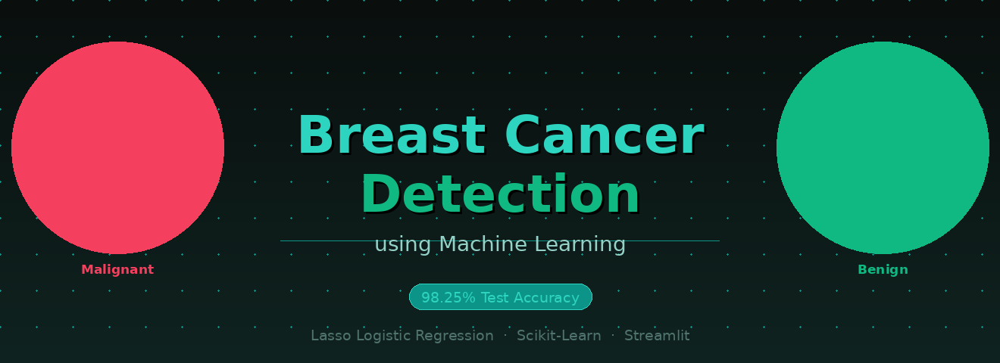

# 🎗️ CancerSense — Breast Cancer Detection
### Classifying Malignant vs Benign Tumors with Machine Learning

<div align="center">
  
</div>

<div align="center">

[](https://python.org)
[](https://scikit-learn.org)
[](https://codealphabreastcancerdetectionmodel-zyhxvzzinu3r5exnqzqqg4.streamlit.app/)
[](#results)
[](LICENSE)

</div>

---

<div align="center">

## 🔗 [→ Open the Live Web App](https://codealphabreastcancerdetectionmodel-zyhxvzzinu3r5exnqzqqg4.streamlit.app/)

</div>

---

## ✦ What Is This?

**CancerSense** is a full end-to-end machine learning project that classifies breast tumors as either **Malignant** (cancerous) or **Benign** (non-cancerous) based on diagnostic measurements — wrapped in a clean, interactive web app.

This isn't just a notebook exercise. It covers the complete ML workflow:
- 📊 Data exploration & feature engineering
- ⚙️ Preprocessing pipelines
- 🏁 Multi-model comparison with cross-validation
- 🚀 Deployment via Streamlit

---

## 💡 Why This Matters

> Early detection is the single biggest factor in surviving breast cancer.

Not everyone has access to specialist diagnostics. A model like this — trained on measurable biomarkers — can assist in the classification process quickly and reliably, especially where specialist access is limited.

---

## 📊 Dataset

Built on the **Breast Cancer Wisconsin dataset** (built into scikit-learn — no downloads needed). Real diagnostic measurements from digitized biopsy images.

| Property | Value |
|---|---|
| 🗂️ Source | Breast Cancer Wisconsin (scikit-learn) |
| 🔢 Samples | 569 patient records |
| 📐 Features | 30 numeric biomarkers |
| 🏷️ Classes | 0 = Malignant · 1 = Benign |
| ❌ Missing Values | None |

---

## 🏗️ Project Structure

```
📁 CancerSense/
├── app.py                          ← Streamlit web app
├── banner.png                      ← Project banner
├── README.md
├── requirements.txt
├── notebook/
│   └── cancer.ipynb                ← Full ML notebook
└── models/
    └── best_breast_cancer_model.pkl
```

---

## 🔧 Feature Engineering

Two derived features were added to practice using different encoders inside a pipeline:

| Feature | Type | Description |
|---|---|---|
| `tumor_size_category` | Ordinal | Small / Medium / Large — binned from `mean radius` |
| `texture_type` | Nominal | Smooth / Rough — median split of `mean texture` |

---

## ⚙️ Preprocessing Pipeline

A `ColumnTransformer` handles different column types cleanly. Everything is wrapped in a single `Pipeline` so preprocessing is consistent at both train and predict time.

| Column Type | Columns | Transformer |
|---|---|---|
| Numerical | All 30 original features | `StandardScaler` |
| Ordinal | `tumor_size_category` | `OrdinalEncoder` |
| Nominal | `texture_type` | `OneHotEncoder` |

---

## 🏆 Model Comparison

7 models trained with **5-fold cross-validation**, then evaluated on a held-out test set:

| Model | CV Accuracy | Test Accuracy |
|---|---|---|
| Logistic Regression | 97.80% | 97.37% |
| Ridge (L2) Regression | 97.80% | 97.37% |
| **✅ Lasso (L1) Regression** | **97.36%** | **98.25%** |
| Support Vector Machine | 97.14% | 97.37% |
| K-Nearest Neighbors | 96.48% | 97.37% |
| Decision Tree | 92.09% | 91.23% |
| Random Forest | 95.82% | 94.74% |

**Winner: Lasso (L1) Logistic Regression — 98.25% test accuracy.**

The L1 penalty pushes less-useful weights toward zero, keeping the model lean and reducing overfitting — which explains why it edged out the rest.

---

## 📈 Results

```
✅ Best Test Accuracy  →  98.25%
✅ Validation Method   →  5-Fold Cross Validation
✅ Final Model Saved   →  best_breast_cancer_model.pkl (full pipeline)
```

The saved `.pkl` includes the full pipeline (preprocessor + model), so it works out of the box at inference time — no re-fitting needed.

---

## 🚀 Run Locally

```bash
git clone https://github.com/Haid3rH/breast-cancer-detection.git
cd breast-cancer-detection
pip install -r requirements.txt
```

Open `cancer.ipynb` and run all cells to reproduce training. Then launch the app:

```bash
streamlit run app.py
```

---

## 🔭 Possible Improvements

- [ ] Add ROC curves and AUC scores to the notebook
- [ ] Use SHAP values for feature importance and explainability
- [ ] Try ensemble stacking methods
- [ ] Expand input controls in the web app

---

## 👤 About the Developer

<div align="center">

**Haider Haroon**
*AI Engineer · ML Developer*

[](https://github.com/Haid3rH)

*Building ML systems that don't just run in notebooks — they ship.*

</div>

---

<div align="center">
<sub>© 2026 Haider Haroon · Built with Python, Scikit-Learn & Streamlit</sub>
</div>
